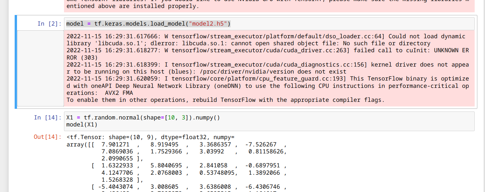

>  今天比较特殊，在A325值班，学习的时间不会太长。

主要是把学长的模型摸清楚然后迁移进app里。后续再看是改成app还是改成其service之类的。

首先是了解一下怎么跑起来，好的，直接跑就能起来。输入是三维，输出是九维，可以准备直接进行一个迁移。



准备工作：

在application中如何使用adb shell中的命令。

在csdn嫖到一个执行命令的工具类。

https://blog.csdn.net/johnWcheung/article/details/102715676

但是他对输出的信息的处理比较垃圾，需要一定的优化。具体体现在ls时没有换行，而是直接字符串拼接了。暂时不必细究。


我的pixel的频率如何修改

首先需要将governor改为userspace。

下面指令涉及了governor的一些文件接口。

```bash
# 查看支持的governor
cat /sys/devices/system/cpu/cpu0/cpufreq/scaling_available_governors
# 查看当前选择的governor
cat /sys/devices/system/cpu/cpu0/cpufreq/scaling_governor
# 查看当前cpu支持的频率档位
cat /sys/devices/system/cpu/cpu0/cpufreq/scaling_available_frequencies
```

重启会恢复选择的governor，会变回scheutil。相对比较安全，只要不瞎搞应该没有太大风险。

小小了解了下pixel的架构，应该是policy0小核，policy4大核，然后在里面修改govnernor为userspace,然后修改scaling_cur_freq即可。

今天的学习应该差不多是结束了，但是可以准备下明天的路线。

yysy还是喜欢用手写的感觉，但是勉强


