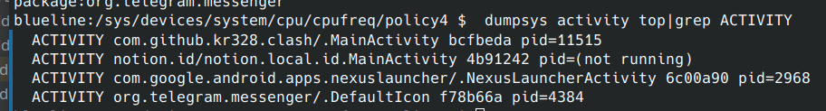
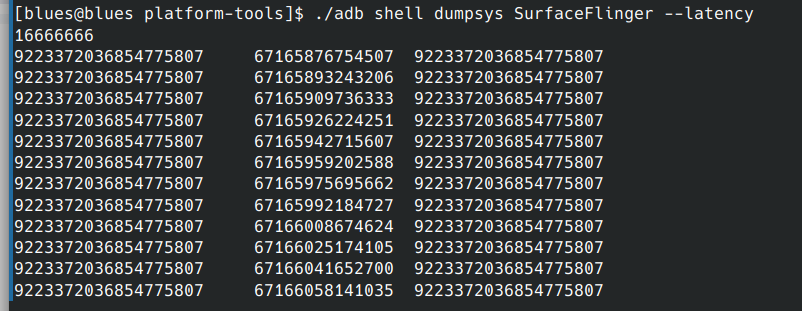
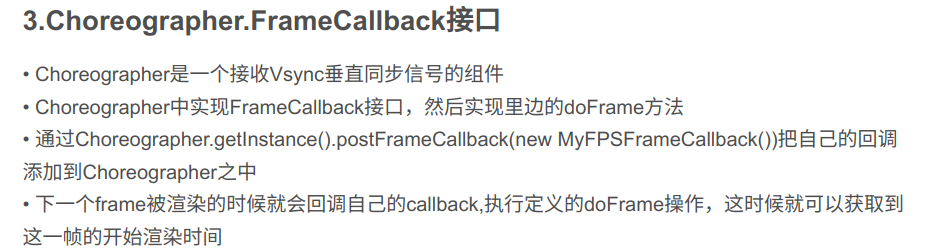
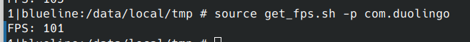

## 11-16学习记录

限定一下情况。

查看大小核的频率可选情况。

小核集群使用policy0, 大核集群使用policy4。分别查看他们的可用频率。

小核的可用频率

```bash
300000 403200 480000 576000 652800 748800 825600 902400 979200 1056000 1132800 1228800 1324800 1420800 1516800 1612800 1689600 1766400 
```

选用30000，979200，1766400，也就是最大最小最中间。

大核的可用频率

```bash
825600 902400 979200 1056000 1209600 1286400 1363200 1459200 1536000 1612800 1689600 1766400 1843200 1920000 1996800 2092800 2169600 2246400 2323200 2400000 2476800 2553600 2649600 
```

选用825600，1766400，2649600，也就是最大最小最中间。

所以就是如下所示的情况。

|情况|小核频率|大核频率|
|----|------|-----|
|1|30000|825600|
|2|30000|1766400|
|3|30000|2649600|
|4|979200|825600|
|5|979200|1766400|
|6|979200|2649600|
|7|1766400|825600|
|8|1766400|1766400|
|9|1766400|2649600|

想要实现的展示的情况是：实现了一个频率调整的app, 并且在systrace或者perfetto中能够看到频率的变化和调整。

准备工作：需要捕获一个app的帧率，那么首先需要知道一个包的包名，通过

```bash
pm list packages # 获取所有的包
```

因为我的pixel中没有抖音，所以使用telegram进行测试，找到telegram的包名：org.telegram.messenger

也可以通过下面指令获得当前所有的activity的包名和pid。

```bash
dumpsys activity top | grep ACTIVITY
```



然后对于一个包进行帧率的查看。

命令的运行和分析

```bash
adb shell dumpsys SurfaceFlinger --latency 
```



第一行是刷新的时间间隔，下面的127行是帧率数据。

• 第一列表示应用程序绘制图像的时间点
• 第二列表示在软件将帧提交到硬件绘制之前的垂直同步时间
• 第三列表示绘制完成时间点

但是不知道为何每一行都是相同的，看不太懂。

还有一种编程实现的，利用Choreographer.FrameCallback接口。但是没有例子




找到一个开源库takt, 该库得到的值fps超过了60hz, 应该不够准确。


找到另一个开源库GetFPS.但是得到的结果，fps超过了60hz, 甚至达到了255， 比较离谱。




该问题中，提到了编程角度获取当前的应用的fps

https://stackoverflow.com/questions/5672503/android-how-to-find-the-frame-rate-of-a-device


累了，进度好慢
