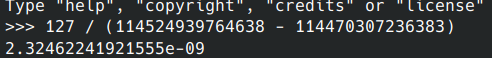
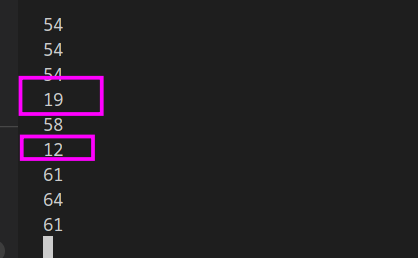
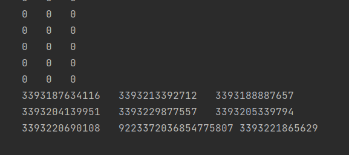

## 11-17 

继续找如何通过adb计算当前应用的帧率。

首先是看@Crescentsm给的博客

https://wizzie.top/Blog/2020/03/31/2020/200330_android_getFPS/

其实上面这个博客昨天有搜索到，但是因为不知道如何获取layername没有继续探索，此处大概就是倒数第二行减去第二行就是127帧的时间。

查看一个例子，首先获得layername的名字。

```bash
 dumpsys SurfaceFlinger | grep telegram
```

然后获得该layer的帧渲染的时间，但是按照公式计算出来的结果很怪。



这个值显然存在问题，但是**不知道**问题在哪。


然后是看@futurecodedalao的代码

75行的get_frame_data函数是其实只是获取了

```bash
adb shell dumpsys SurfaceFlinger --latency Layername
```

的输出，然后把时间转换成了秒。

代码中用到了下面的adb命令。

```bash
./adb shell input swipe 100 500 100 200
```

作用是模拟手的滑动，应该是让屏幕动一下用来计算帧率的。（**问题，如果应用本身并不支持滑动，或者用户不希望应用进行滑动，此时该如何计算帧率呢**）


学长计算帧率的方法，先调用一次get_frame_data，然后模拟滑动，然后再调用一次get_frame_data，然后合并两次得到的时间戳，并且以最后一个时间戳为结尾，计算最近1s渲染了多少帧。

直接调用学长的代码获取fps,但是

- 在没有操作时会导致fps的计算存在问题。
- 存在看起来比较异常的值。
- 且在无操作时，fps会始终重复上一个。



但是先不管三七二十一，先把它转成java, 写进代码吧。

遇到了问题，明明是相同的指令，都是，但是在java上执行时，却大多数值都是0, 非常离谱。

```bash
dumpsys SurfaceFlinger --latency com.example.networktrans/com.example.networktrans.MainActivity#0  
```

基本上得到的都是只有最后几行有数据的情况，然后其他都是0.



但是直接在adb shell中执行是正常的。
