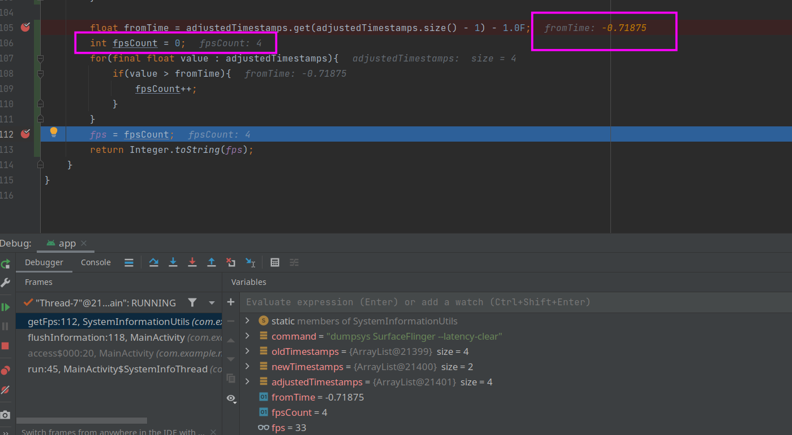

## 11-20

今天试图解决问题和进行一点开发

首先问题在于：

1.这个获取帧率是一定要亮屏幕的，否则一定是空。

屏幕不亮就直接放最低频率运行吧。

2.获得的帧率几乎是不准确的。

这个暂时不管了，放进todo里。

3.有时候因为获得的数据为空会导致整个程序异常退出。

throw error了，退出是不会退出了。

要做的事情：

1.把龙哥fpsget2.0放到程序中去。

几乎没有什么区别，就是把划屏幕的注释了。

2.看能否解决当前的帧率不正确的问题。

目前几乎不可能解决，时间关系，不太能提出更好的算法。

3.在不考虑精度的情况下，让整个程序能够顺畅跑起来。

程序存在几个地方经常崩溃，此处进行崩溃的记录。

在多次测试以后，在105行出现对齐的timestamp为空的情况。对其进行调试。查看发生了什么，对代码进行简单分析，就是timestamp的数组中根本就没有数据。那么也就是dumpsys时输出全部都是0.

几次断点后发现，存在帧率越来越少的情况，并且fromtime达到了负数，这显然是不合适的。

还有一次在第40行出现了首次手机frame时为空的情况，这个显然也是不合适的。经断点鉴定为，就是手机没动导致导出的数据就是很空。

所以需要对这些地方进行一定的判断，并且给出提示。

那么这里需要学习一点安卓开发的异常处理，但是修补应该不是大问题，暂时各处做好注释即可。

进行了简单的异常处理和判断，让他至少不要经常崩溃。

但是如果我一次性点了太多次获得帧率他还是会崩溃。

但是猜测这部分或许可以将其修改为每1s进行一次解决。确实解决了，但是也确实发现只要屏幕不动，那么就会是0。

4.大体策略

首先程序运行时，整个程序就要开始收集系统的帧率和频率，然后使用神经网络进行获得策略，然后修改机子的频率即可。

可能存在的问题：

1.精度问题，发现其处于一个相同的状态未改变

2.权限问题，直接在emulator上是无法启动的。

3.形式问题，目前是application格式，但是学长希望是service格式。

此处试图将使用神经网络迁移剥离出来，但是发现好像context只能在activity和service中才有，普通的类是没有的，所以没法整个剥离。
